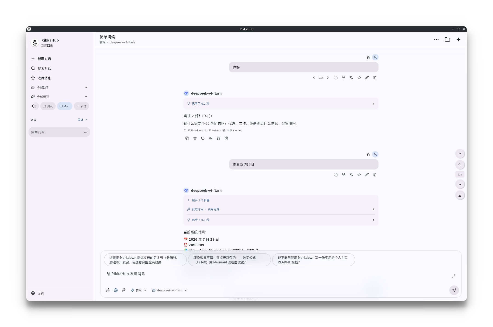

<div align="center">
  
  <h1>RikkaHub</h1>
  <p>原生 Linux 桌面 LLM 聊天客户端。</p>

  简体中文 | [English](README.md)
</div>

<div align="center">
  
</div>

## 构建

需要 JDK 17 或更新版本：

```bash
./gradlew :desktop:run
./gradlew :desktop:createDistributable
cd packaging/arch && makepkg -si
```

Arch 软件包内置 Java 运行时。设置保存在 `$XDG_CONFIG_HOME/rikkahub/desktop.json`
（默认 `~/.config/rikkahub/desktop.json`），会话保存在 `conversations/` 下的独立文件中。

## 许可证

本项目基于 [GNU Affero General Public License v3.0](LICENSE) (AGPL-3.0) 开源。
